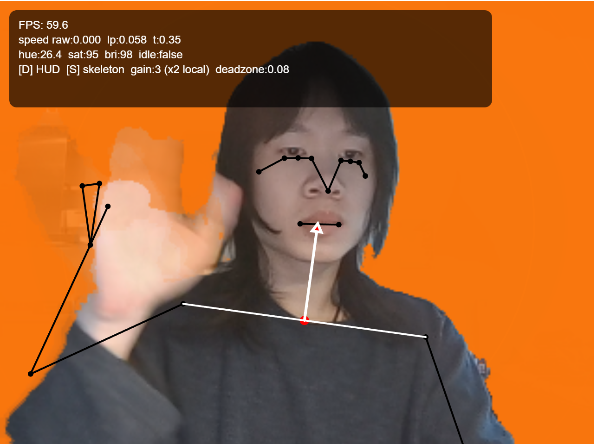
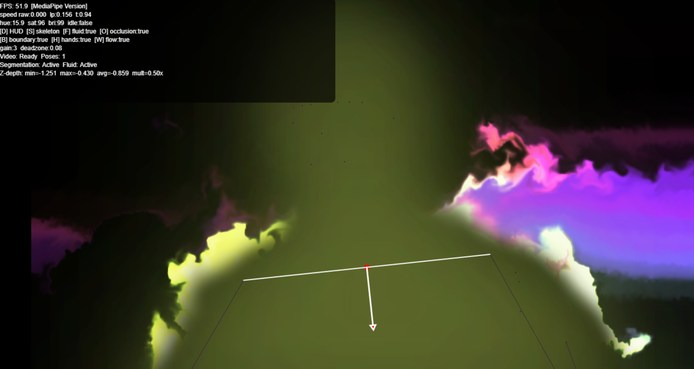
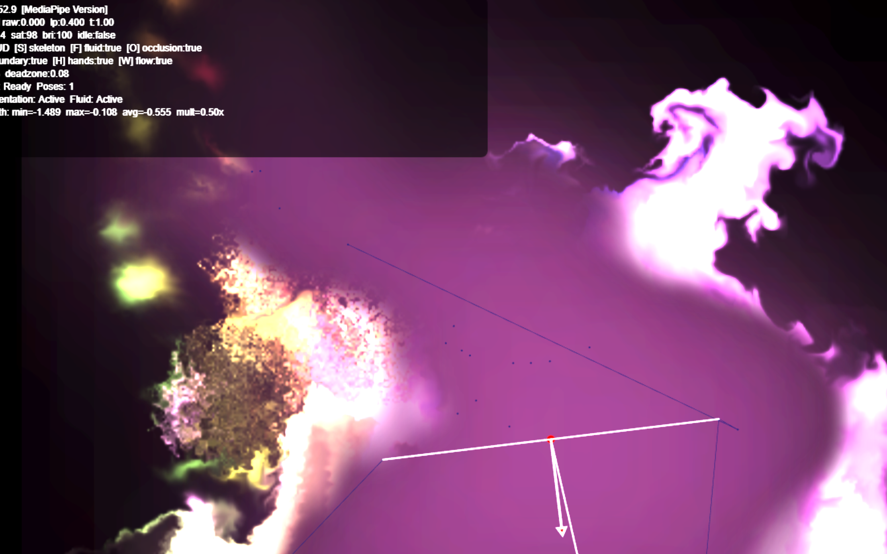
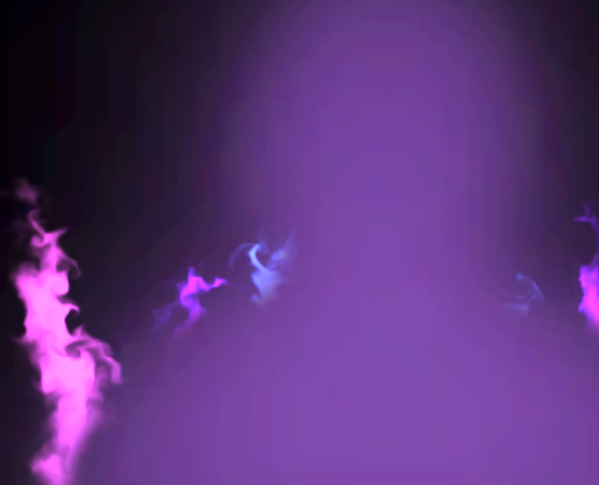
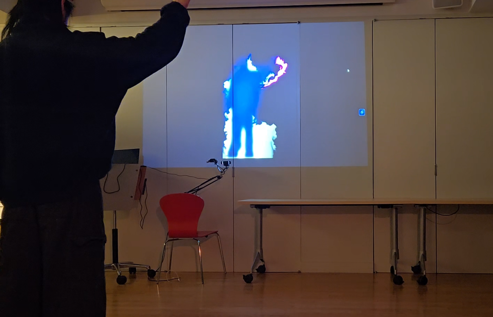

# Smoke and Mirrors
 A camera-based projection that turns your movement into a fluid-like visual—your gestures “push” a fluid simulation on screen, creating real-time trails, ripples, and color shifts.

## Project Overview
### What it is
A real-time, camera-based interactive projection/visual system. Your movement is tracked live and used to drive a fluid simulation, turning your body into a “controller” for the visuals.

### Demo
https://dchiasva.github.io/hello-world--2025-final-darren-chia/interactions_mediapipe_index.html

### Why it exists
Originally designed as an “instrument for dancers” (movement-driven instead of music-driven), the project evolved into something more visual and playful—meant to help people feel more comfortable moving and experimenting with their body in a low-pressure way. Dance is still the core goal.

### Audience
- Dancers (primary intention)
- Anyone who wants a fun, low-pressure way to move and explore body movement

### Goals
- **MVP:** Reliable real-time tracking + responsive fluid visuals that feel smooth (not laggy).
- **Nice to have:** Projection mapping calibration, more visual modes, audio/haptic response, better UI controls for tuning.

---

## Technical Details
### Tools + Languages
- JavaScript / p5.js
- Computer vision / tracking:
  - Started with **ml5.js** (template + early prototypes)
  - Switched to **MediaPipe** for improved tracking

### Techniques explored
- Fluid simulation driven by motion input
- Body tracking (skeleton/landmarks + later finger tracking)
- Optional background segmentation + mask processing
- Smoothing + prediction for stability and responsiveness:
  - Exponential smoothing (SES)
  - Adaptive SES + prediction
  - Kalman filter experiments
- Performance optimizations:
  - Reduced resolution then upscaled
  - Updating heavy operations every other frame
  - FPS monitoring

---

## How to Run
> This repo contains multiple HTML/JS pairs. Use the ones below depending on what you want to test.

### Run locally (recommended)
1. Clone/download the repo
2. Start a local server in the project folder (examples):
   - VS Code **Live Server**, or
   - `python -m http.server` (Python 3)
3. Open the local URL in your browser (often `http://localhost:8000`)
4. Allow camera permissions

### Run the final demo (recommended)
Open:
- `interactions_mediapipe_index.html` (loads the final MediaPipe-based JS)

### Run experiments (optimization / responsiveness)
Open:
- `base_index.html` (loads `base.js`)

> Note: Some sketches may require HTTPS or localhost for camera access.

## Media
**Base version**    

**Fluid simulation**  
     

**Fluid simulation with hands**  
 

**Skeleton and HUD off**  
 

**Live Demo**

https://drive.google.com/file/d/1UCb5tlaIScIAUkESwaJoMux5mKLevoJT/view?usp=sharing 
---

## Project Structure
This project includes multiple “sketch” variants (each HTML file loads a different JS file).

### Final version (recommended)
- `interactions_mediapipe_index.html` — final demo page
- `interactions_mediapipe.js` — final interaction + fluid simulation implementation (MediaPipe)

### Experiment / R&D versions
- `base_index.html` — baseline testing page (responsiveness + optimization)
- `base.js` — baseline sketch logic

### Other experiments
- Additional `*.html` + `*.js` pairs: earlier iterations and interaction tests (ghosting, trails, segmentation toggles, smoothing experiments, etc.)

---

## Process / Timeline (Source: Darren’s compiled notes)
### Week 1 — Proposal (Initial concept)
- **Project:** Dance Projection Mapping (early working concept)
- **Concept:** Create an “instrument for the dancer” where movement drives the environment.
- **Experience goal:** Movement shapes visuals (and originally: music/haptics), creating a feedback loop between body and atmosphere.
- **Shift:** MVP moved toward a more artsy/purely visual direction—still dance-centered, but broadened to help anyone feel more comfortable moving.

### Week 2 — Nov 24 (Prototype foundations)
- Initial commit
- Started from an **ml5 template**
- **Prototype V1:** background segmentation + skeleton overlay (toggle on/off)
- Added/moved work into `docs/` folder

### Week 3 — Dec 1–6 (Refinement + smoothing + performance)
**12/01**
- Created additional entry points and began organizing experiments

**12/02**
- Added FPS counter
- Color changes every other frame (smoother)
- Removed bright HUD flare
- Added exponential smoothing (factor ~0.65)
  - 0.99 was too jittery

**12/05**
- Added/tested:
  - Adaptive SES with prediction
  - Reduced resolution then upscaled
  - Kalman filter experiments
  - Skeleton smoothing + color sensitivity tuning

**12/06**
- Added different test modes for iteration:
  - Base mode (tracking/video optimization)
  - Light mode (trail effects)
  - Ghosting mode (ghosting + RGB delay)
- Mask dilation (less clipping)
- Adaptive SES for segmentation smoothing
- Updated mask SES every other frame (FPS improvement)
- Anti-aliasing
- Reduced skeleton smoothing slightly for responsiveness

### Week 4 — Dec 8–10 (Fluid simulation + tracking upgrade)
**12/08**
- Added fluid simulation
- Modularized fluid simulation + variable tweaking

**12/09**
- Removed banding and vignette

**12/10**
- Switched to **MediaPipe**
- Red test glow + distance calculations working
- Finger tracking
- Segmentation mask toggleable (default OFF; focus on movement tracking)

---

## Challenges + Solutions
### Smoothness vs responsiveness
- **Issue:** Skeleton lag and jitter; mask instability.
- **Approaches:** SES, adaptive smoothing + prediction, Kalman experiments, separate smoothing for mask vs skeleton.
- **Result:** Better perceived smoothness; continued tuning to avoid “laggy” feel.

### Real-time performance
- **Issue:** Tracking + effects can drop FPS.
- **Approaches:** Reduce resolution & upscale, update expensive steps every other frame, FPS counter for tuning.
- **Result:** Smoother output and fewer hiccups.

### Visual artifacts / edge quality
- **Issue:** Mask clipping, jagged edges, banding/vignette artifacts.
- **Approaches:** Mask dilation, anti-aliasing, removed banding/vignette.
- **Result:** Cleaner silhouette and improved visuals.

### Tracking quality
- **Issue:** Early model/template limitations.
- **Solution:** Switched from ml5-based approach to MediaPipe.

---

## Credits
### Libraries / APIs
- p5.js
- ml5.js (early prototypes/template)
- MediaPipe (final tracking)

### Fluid simulation reference
Fluid simulation implementation was based on:
- https://paveldogreat.github.io/WebGL-Fluid-Simulation/

### AI Tools Used
This project used AI-assisted coding tools during development:
- Claude Code
- GitHub Copilot

> If required, add example prompts or specific areas where these tools helped.

### Collaborators
- Solo project

### Resources
- https://docs.ml5js.org/#/reference/bodypose

---

## Reflection
### What worked well
- Getting the smoothing/optimization to a place where it stayed **smooth but still really responsive**. By the final version, the interaction felt immediate instead of laggy.
- Implementing the **fluid simulation** itself went well, and it ended up being a strong “core” visual that reacted clearly to movement.

### What I would improve with more time
- Add **more visual variety** (more modes / styles), instead of mostly one main look.
- Lean further into the **dance-specific side** with clearer “states” or modes based on movement qualities (ex: body isolations, grooves/textures, or different dance styles).
- Add an option to **pair with music** so the visuals respond to audio as well, not only movement (right now it’s more of a free-play mode).
- Support **multiple people**—a lot of viewers expected multi-person interaction instead of single-user tracking.
